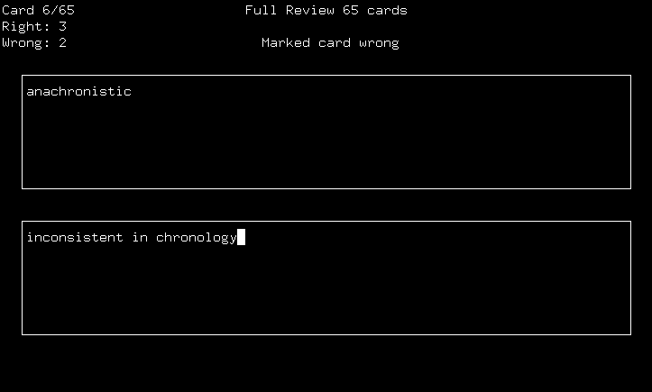

# Sort Study CLI

A simple, free, and open source command line interface for efficiently studying index cards

Currently available for Linux

*From the man page:*

**sortstudycli** is an ncurses interface for efficiently studying index cards.

Decks of index cards are contained in card files. These are text files in which the first line contains the front text of the first card, the next line contains the back text of the first card, the next line contains the front text of the next card, and so forth. Card files are formatted this way so they can be typed easily.

*Example card file:*

    word 1
    definition 1
    word 2
    definition 2
    word 3
    definition 3
    ...

When provided with one or more card files, Sort Study will enter review mode. This will present the user with the front text of the first card. Pressing J will show the back text of the card. If the user has correctly guessed the back of the card, they can press L to mark the card as "right." Otherwise, pressing K will mark the card as "wrong," setting it aside for future review. After a card is marked, the next card will be shown, until all cards have been marked.

The next set of cards to be reviewed will contain all of the cards previously marked as wrong, and the review following that will contain all of the cards that have still been marked as wrong. Once all cards have eventually been marked as right, the entire deck will be reviewed again.

This automated reviewing process allows users to spend the most time studying difficult cards, increasing time efficiency.

To modify card decks on the fly, Sort Study allows users to shuffle, flip, and delete sets of cards within review mode. Here is a list of all of the controls available to the user in review mode:

    J	toggle the visibility of the back of a card
    K	mark a card as wrong
    L	mark a card as right
    D	delete card (so it isn't reviewed again)
    B	toggle the drawing of card borders
    Q	quit
    N	start the next review (available when a review is finished)
    F	flip all cards (swap the front and back text, available when a review is finished)
    S	shuffle cards (available when a review is finished)

## Dependencies

This program uses ncurses for drawing to the terminal.

On Debian-based Linux distros, you can install ncurses with this command:

    sudo apt install ncurses-base

## Building

To compile the program yourself, you'll need the ncurses header files, GNU make, and GCC.

On Debian-based Linux distros, you can install these with this command:

    sudo apt install libncurses5-dev libncursesw5-dev make gcc

Clone the repository and enter it like so:

    git clone https://github.com/lukelawlor/sortstudycli
    cd sortstudycli

Build the program with GNU make:

    make

Then install the executable to /usr/local/bin:

    sudo make install

Uninstall the program like so:

    sudo make uninstall

If you don't want to compile with GCC, feel free to use the compiler of your choice and set it to `CC` in the Makefile
